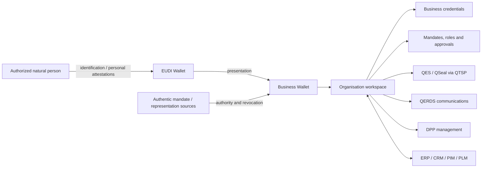

# Business Wallet Architecture

**Status:** [PRODUCT] / [OPEN]

The Business Wallet is an organisation workspace and orchestration layer, not a second personal EUDI Wallet. Regulatory requirements remain proposal-dependent.

## Separation of concerns

- Organisation identity is distinct from the identity of a person operating the workspace.
- Authentication is distinct from authority to represent, approve, sign or seal.
- Business credentials and mandates need authoritative issuers and lifecycle/revocation semantics.
- Qualified operations cross a QTSP-controlled boundary.
- DPP is a sector module using organisation/mandate capabilities but retaining its own lifecycle.

`[OPEN]` Requires validation: final EUBW obligations, portability/interoperability model, organisational identifier sources, mandate authorities and multi-user assurance controls.
