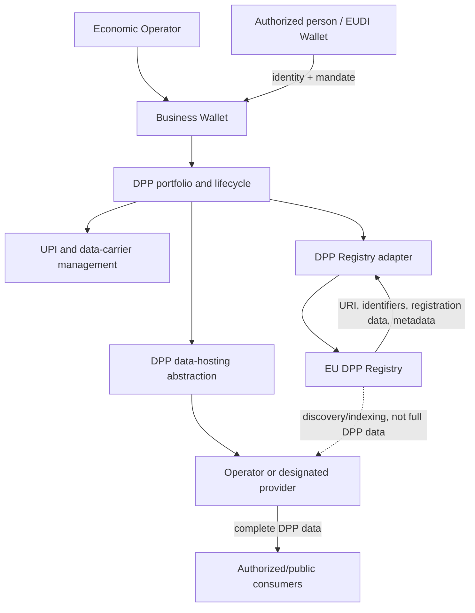

# Business Wallet + DPP Integration

**Status:** [PRODUCT] / [EXPERIMENTAL]

## Hypothesis

DPP management should be a **Business Wallet module**, while the DPP itself remains an independent product-data resource.

Candidate capabilities:

- portfolio of products/DPPs owned or managed by the organisation;
- DPP creation workflows;
- DPP Registry registration;
- UPI/URI management;
- model/batch/item lifecycle;
- delegated DPP administration through organisational mandates;
- product compliance credentials;
- links to DPP hosting/data services;
- audit and compliance communications;
- integration with ERP/PIM/PLM systems.

The Registry adapter and data-hosting abstraction must remain separate deployable concerns. Registry success does not prove the hosted DPP is complete, available or compliant.

See [DPP Registry](dpp-registry.md), [lifecycle](dpp-lifecycle.md), and [economic-operator onboarding](economic-operator-onboarding.md).
