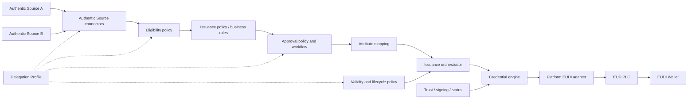
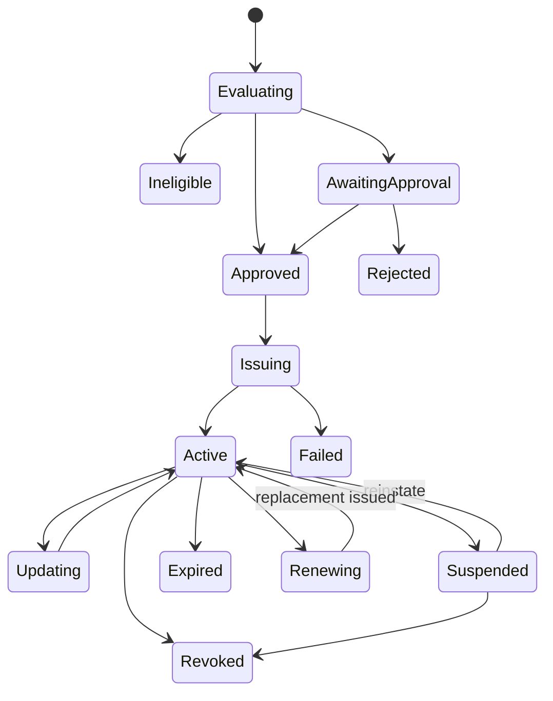

# Issuance as a Service

**Status:** [PRODUCT] / [EXPERIMENTAL]

## Foundational principle

> [PRODUCT] The platform supports configurable delegation of the issuance lifecycle. Attribute retrieval, eligibility determination, business rules, approval and credential lifecycle actions may be performed by the customer, by the platform, or through a hybrid workflow where the applicable provider regime permits it. Authentic Sources always remain the authoritative systems of record for source data.

Executing a decision does not make the platform an Authentic Source. Likewise, technically issuing a credential does not by itself determine which party is legally the Attestation Provider. `[REGULATORY]` A PuB-EAA provider must be the responsible public-sector body or another Member-State-designated public-sector body; a QEAA provider must be the QTSP for the qualified service. `[OPEN]` Outsourced technical operation remains subject to the constraints in the [operating-model analysis](attestation-provider-operating-models.md).

## Service models

The models are configurations of one platform, not rigid product editions.

| Lifecycle responsibility | Model A: Gateway | Model B: Managed Issuance | Model C: Hybrid |
|---|---|---|---|
| Authentic Source | Customer/external authority | Customer/external authority | Customer/external authority |
| Source connectivity and retrieval | Customer | Platform | Assigned per profile |
| Eligibility and business rules | Customer | Platform | Assigned per profile |
| Final approval | Customer | Platform/workflow | Customer, platform or joint workflow |
| Credential configuration and mapping | Platform, using approved input | Platform | Assigned per profile |
| Generation, signing and OID4VCI | Platform | Platform | Platform |
| Renewal, suspension and revocation decisions | Customer-driven by default | Platform policy/source-driven | Assigned per profile |
| Trust, status, interoperability and audit | Platform | Platform | Platform, with customer actions recorded |

### Model A — Issuance Gateway as a Service

The customer retrieves source data, evaluates eligibility and rules, and approves a credential. It sends approved credential data to the platform, which performs configuration validation, orchestration, credential generation, signing, trust/status integration, OpenID4VCI delivery and audit.

### Model B — Managed Issuance as a Service

The customer retains its external Authentic Source. The platform connects to one or more sources, retrieves and maps attributes, evaluates eligibility and issuance policy, runs approval when configured, technically issues the credential, and manages lifecycle execution. `[INFERENCE]` “Managed” describes operational breadth, not transfer of legal-provider, signing-identity or revocation authority. PuB-EAA and QEAA use constrained public-body and QTSP profiles respectively.

### Model C — Hybrid issuance

A Delegation Profile assigns every lifecycle step independently. For example, the platform may retrieve data and determine eligibility while the customer gives final approval; another customer may determine eligibility but delegate approval workflow and lifecycle operations. `[PRODUCT-HYPOTHESIS]` A separate Provider Operating Profile constrains those choices by regime and binds the provider, trust and cryptographic identities.

## Delegation Profile

**Status:** [PRODUCT]

A versioned Delegation Profile assigns an executor to each step: `CUSTOMER`, `PLATFORM`, or `HYBRID_WORKFLOW`. It also defines hand-off evidence, timeouts, escalation, retry and authorization requirements. A profile is referenced by the Credential Type and snapshotted on each Issuance Transaction so later changes do not rewrite history.

Minimum assignable steps are source retrieval, attribute mapping, eligibility, business-rule evaluation, approval, issuance initiation, renewal/update, suspension and revocation. Authentic-source ownership is not assignable to the platform.

## Credential lifecycle

Lifecycle triggers can be customer-driven, source-driven, platform-driven or hybrid. Source-driven automation must evaluate a fresh, attributable source observation; it must not treat a connector cache as the authority.

See the [operating-model analysis](attestation-provider-operating-models.md), [issuer product model](issuer-product-model.md), [provider architecture](../08-architecture/attestation-provider-architecture.md), [service architecture](../08-architecture/issuance-service-architecture.md), [API concepts](api-concepts.md), [issuer onboarding](issuer-onboarding.md), and [issuance MVP](../09-product-roadmap/issuance-mvp.md).
