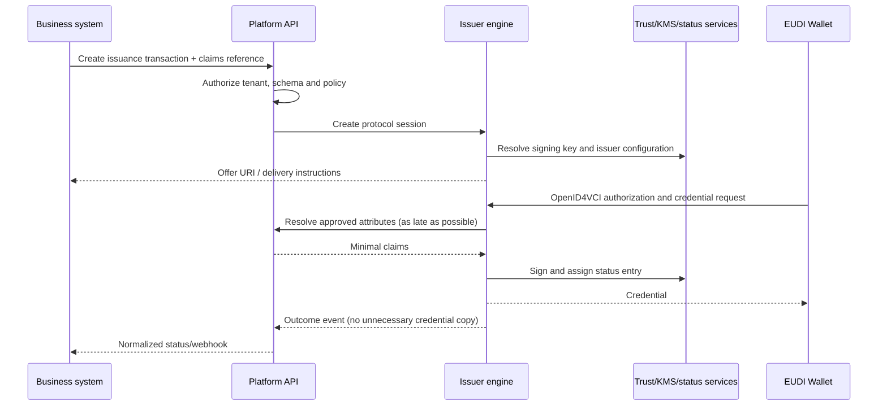

# Issuance as a Service

**Status:** [PRODUCT] / [EXPERIMENTAL]

## Target users

- small and medium public administrations;
- universities and educational bodies;
- professional organisations;
- public agencies;
- SMEs and sector credential issuers.

## Proposition

The customer should interact through a simple API/workflow while the service handles protocol, credential format, cryptography, trust, status and interoperability concerns.

## Initial scope

- Authorization-code and pre-authorized-code offers; deferred issuance only where a use case needs it.
- `dc+sd-jwt` and `mso_mdoc` through format-neutral business contracts.
- Issuer metadata, keys/certificates, status, notifications and wallet interoperability tests.
- Attribute-provider callback or just-in-time claims, minimizing platform retention.

## Boundaries

- [SPECIFICATION] OID4VCI compatibility does not prove that an issuer is authorized or trusted for a credential type.
- [PRODUCT] The business system remains authoritative for eligibility and source data unless explicitly contracted otherwise.
- [OPEN] Rulebooks, registration, access/registration certificates, wallet attestation and status requirements must be selected per scheme.

See [API concepts](api-concepts.md), [onboarding](onboarding.md), and [EUDIPLO assessment](eudiplo-assessment.md).
