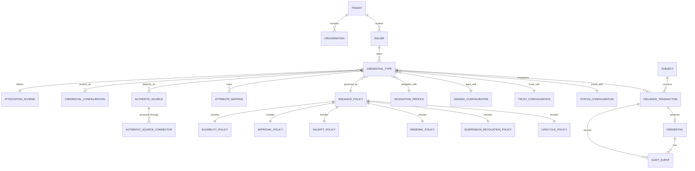

# Issuer Product Model

**Status:** [PRODUCT] preliminary domain model / [OPEN] implementation details

## Model



## Concepts and boundaries

| Concept | Meaning and ownership boundary |
|---|---|
| Tenant | Security and commercial isolation boundary containing issuers, configurations, connections, policies, transactions, audit and administrators |
| Organisation | Legal/operational customer entity represented within a tenant; not necessarily the legal Attestation Provider |
| Issuer | Configured issuing context and identifier used for a set of Credential Types; legal role remains [OPEN] |
| Authentic Source | External authoritative system or accountable data source for specific facts |
| Authentic Source Connector | Technical adapter and credentials used to query/subscribe/import from an Authentic Source; never the authority itself |
| Credential Type | Versioned product blueprint describing semantics, policies, dependencies and supported formats |
| Attestation Scheme | External scheme/rulebook and governance context applicable to a Credential Type |
| Credential Configuration | Protocol/format/display configuration used to materialize a Credential Type |
| Attribute Mapping | Versioned mapping and transformation from one or more source observations to credential claims |
| Issuance Policy | Composite decision model coordinating eligibility, approval, validity and lifecycle rules |
| Eligibility Policy | Determines whether the subject/current facts satisfy issuance conditions |
| Approval Policy | Determines whether human/system approval is required, who may approve and separation-of-duties constraints |
| Validity Policy | Determines validity period and dating rules |
| Renewal Policy | Determines renewal window, re-evaluation, replacement and overlap behavior |
| Suspension / Revocation Policy | Determines triggers, authorization, status transition and reinstatement rules |
| Lifecycle Policy | Coordinates update, renewal, suspension, revocation, expiry and reinstatement triggers/actions |
| Delegation Profile | Assigns each lifecycle responsibility to customer, platform or hybrid workflow |
| Issuance Transaction | Immutable-history process instance using snapshotted policy/configuration versions and source evidence references |
| Credential | The issued cryptographic artifact and lifecycle record produced for a Subject; distinct from its Credential Type blueprint |
| Subject | Person or entity about whom the credential makes claims; represented by privacy-preserving references where possible |
| Signing Configuration | Key purpose, algorithm/profile and KMS/HSM routing; does not establish qualified status |
| Trust Configuration | Issuer metadata, certificates, scheme/registrar and trust-source configuration |
| Status Configuration | Status mechanism, list allocation, publication and freshness settings |
| Audit Event | Purpose-limited record of actor, action, policy/config versions, evidence references and outcome |

## Cardinality and versioning rules

- A Credential Type may depend on multiple Authentic Sources; one source may support many types.
- A source may expose multiple connectors for environment, protocol, region or resilience, but connector output retains source provenance.
- Credential Type, mappings, policies, delegation, trust, signing and status configuration are versioned independently and resolved into a transaction snapshot.
- A transaction produces at most one active issued artifact in the initial model; replacement/renewal links transactions and credentials explicitly.
- Policy-engine technology is `[OPEN]`; no rules engine is selected in this iteration.

## Credential Type policy composition

```text
Credential Type
  ├── Attestation Scheme / Rulebook
  ├── Authentic Source(s) + Attribute Mapping
  ├── Eligibility + Issuance + Approval Policies
  ├── Validity + Renewal + Suspension / Revocation + Lifecycle Policies
  ├── Delegation Profile
  └── Credential Format(s) + Trust + Signing + Status Configurations
```

## Regulatory caution

`[OPEN] Requires legal/regulatory analysis.` Delegation of technical execution, eligibility evaluation or approval does not by itself determine the legal Attestation Provider or transfer Authentic Source status. EAA, PuB-EAA and QEAA models require a separate role-and-liability analysis.
