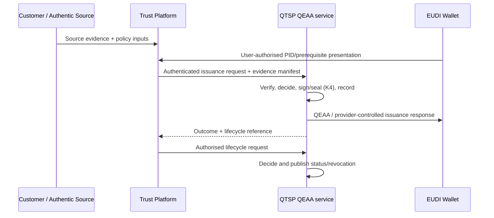

# QEAA / QTSP Operating Model

**Decision:** Do not sell “QEAA issued by the platform” unless the platform legal entity and service become qualified. Offer technology to QTSPs or a QTSP-partnered service.

**Status:** [REGULATORY] / [IMPLEMENTING-ACT] / [PRODUCT-HYPOTHESIS] / [OPEN]

## Hard boundary

`[REGULATORY]` eIDAS Article 3(45) defines a QEAA as an EAA issued by a QTSP that meets Annex V. Articles 20-22 require conformity assessment, supervisory grant of qualified status and national trusted-list publication before the qualified service starts. Annex V requires the qualified signature or seal and unambiguous identity of the issuing QTSP.

`[REGULATORY]` The QTSP therefore remains provider and accountable for the qualified service even when third parties perform components. It must control or accept subject identity/attribute verification, issuance approval, scheme/practice compliance, the qualified signing/sealing operation, status and revocation authority, audit/evidence, incident and termination handling, supervision and liability. Article 24(1a) allows identity verification through an appropriate third party; it does not transfer provider status.

## Strategy A — platform for QTSP

**Rating: AMBER.** `[PRODUCT-HYPOTHESIS]` License or deploy the platform as technology within the QTSP's controlled, documented and assessed qualified-service boundary.

| Platform may supply | Must remain QTSP-controlled |
|---|---|
| `[PRODUCT-HYPOTHESIS]` Customer/source connectors, mapping, workflow UI, policy engine, transaction orchestration, OpenID4VCI components, lifecycle tooling and evidence collection | `[REGULATORY]` Qualified-service policy/practice, decision authority, accepted verification methods, provider identity, K4 signing/sealing and key/QSCD boundary, Article 22 status, status/revocation authority, conformity, supervisory communications, incidents/termination and liability |

`[OPEN]` Deployment topology is secondary to effective control and conformity scope. SaaS operation outside the assessed QTSP environment is not automatically invalid, but requires CAB/supervisor acceptance, enforceable QTSP control, auditability, security/continuity, data separation and subcontractor governance.

## Strategy B — partner/joint offering

**Rating: GREEN/AMBER.** `[PRODUCT-HYPOTHESIS]` The platform onboards the commercial customer and source, evaluates preliminary eligibility, runs workflow and calls a QTSP qualified-issuance API. The QTSP verifies or accepts the evidence, makes the qualified issuance decision and issues/signs/seals under its own identity.

### API boundary

`[PRODUCT-HYPOTHESIS]` The contract should carry QTSP customer/tenant, scheme and attestation type/version, Wallet binding material, subject-identification method, source and policy evidence references, purpose/consent or other authority metadata, claims proposed, validity, idempotency, approval evidence and callback/status references. It must be authenticated, integrity-protected, replay-resistant and fully attributable.

`[INFERENCE]` The QTSP response should distinguish `accepted`, `rejected`, `more evidence required` and `issued`; a successful platform policy result must never force the QTSP to sign. The QTSP owns final claim validation, issuer metadata, credential signature/seal and authoritative lifecycle state.

## Registration, trust and key custody

- `[REGULATORY]` The QEAA provider/service is the QTSP and relevant qualified service appearing in the national trusted list under Article 22.
- `[SPECIFICATION]` ARF 3.0 expects Wallet Units to validate the QEAA provider trust path and provider access/registration material, and the provider to validate the Wallet Unit.
- `[REGULATORY]` Annex V identifies the issuing QTSP; a platform key under a different identity cannot sign a QEAA on the QTSP's behalf.
- `[IMPLEMENTING-ACT]` Regulation 2025/1569 requires a QSCD for the EAA signature/seal and qualified-provider revocation/status controls. K4 is the normal boundary; K1/K2 are only candidates if they are QTSP-controlled and included in the qualified-service assessment.
- `[REGULATORY]` Article 45h requires personal-data separation and functional separation of qualified EAA services. Multi-tenant product storage and analytics must preserve this boundary.

## Source verification

`[REGULATORY]` Article 45e requires Member States to enable QTSP QEAA providers to verify Annex VI public-source attributes electronically at the user's request. `[IMPLEMENTING-ACT]` Regulation 2025/1569 Article 9 allows access controls confirming that the requester is a QTSP acting on a legitimate user's request and standardises a verified/not-verified result and responsible body.

`[PRODUCT-HYPOTHESIS]` The platform may integrate these endpoints, but the request must represent the QTSP where required and the QTSP must accept the result into its qualified process. `[OPEN]` National intermediary onboarding, evidence retention and whether platform credentials may be used technically on the QTSP's authority require jurisdiction-specific confirmation.

## Liability and operational evidence

`[REGULATORY]` Supplier contracts can allocate recourse but cannot displace eIDAS provider obligations or third-party rights. `[PRODUCT-HYPOTHESIS]` The platform must provide immutable configuration/version references, source provenance, policy and human decisions, cryptographic request/response evidence, operational logs, security events, SLA/continuity evidence and export/termination capability to the QTSP.

## Sources

- [eIDAS consolidated, Articles 3(45), 13, 20-24, 45d-45h and Annex V](https://eur-lex.europa.eu/eli/reg/2014/910)
- [Implementing Regulation 2025/1569, current consolidated text](https://eur-lex.europa.eu/legal-content/EN/TXT/?uri=CELEX:02025R1569-20260811)
- [Implementing Regulation 2025/2530 on QTSP requirements](https://eur-lex.europa.eu/eli/reg_impl/2025/2530/oj/eng)
- [ARF 3.0 QEAA Provider role](https://eudi.dev/3.0.0/main/03-roles-within-the-eudi-wallet-ecosystem/#36-qualified-electronic-attestation-of-attributes-qeaa-providers)
