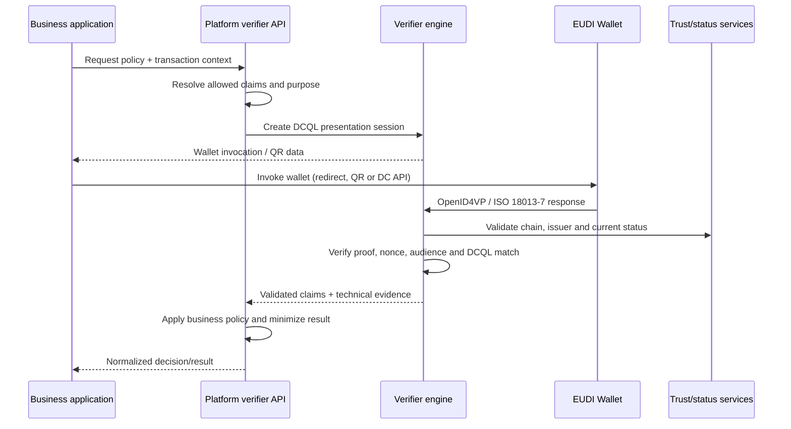

# Verification as a Service

**Status:** [PRODUCT] / [EXPERIMENTAL]

## Proposition

Allow an organisation to request trusted attributes from an EUDI Wallet and receive a normalized, policy-validated result without implementing the full verifier/Relying Party stack.

Candidate responsibilities:

- presentation request generation;
- wallet invocation integration;
- OpenID4VP / DC API abstraction;
- RP authentication and registration integration;
- cryptographic and trust validation;
- credential status checks;
- policy and intended-use enforcement;
- normalized response/API;
- audit evidence.

## Result contract

The default response should separate `protocol_validation`, `trust_validation`, `status`, `policy_decision`, normalized claims and an evidence reference. Raw credentials should not be retained or returned by default.

- [SPECIFICATION] Cryptographic validity is not the same as issuer authorization or business acceptance.
- [PRODUCT] The platform policy layer owns purpose, minimum-claim selection and the final business decision.
- [OPEN] Retention, transaction-data signing and offline/cached-status policies require validation per use case.

See [presentation](../02-eudi-wallet/presentation.md), [trust services](trust-services.md), and [security](../06-shared-capabilities/security.md).
