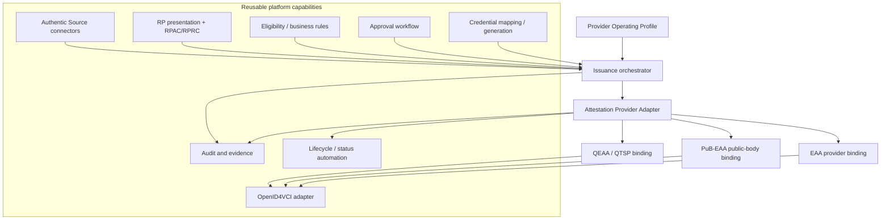

# Attestation Provider Architecture

**Status:** [PRODUCT-HYPOTHESIS], constrained by [REGULATORY] and [IMPLEMENTING-ACT] provider profiles

## Decision

Introduce an **Attestation Provider Adapter** behind the existing issuance orchestrator. `[PRODUCT-HYPOTHESIS]` The abstraction is valuable only if it exposes regime-specific authority, identity, key, trust and lifecycle operations. A lowest-common-denominator credential signer would hide the controls the product must prove.



## Three independent planes

| Plane | Record and enforce |
|---|---|
| Authority plane | `[PRODUCT-HYPOTHESIS]` Legal provider, scheme, Authentic Source relationship, delegation, policy owner, decision/approval authority, revocation authority and regulatory actors |
| Trust/cryptographic plane | `[PRODUCT-HYPOTHESIS]` Provider identifier, registration/access artefacts, trusted-list/Commission-list/LoTE source, certificate chain, key model K1-K4, HSM/QSCD route and status endpoints |
| Execution plane | `[PRODUCT-HYPOTHESIS]` Customer/platform/QTSP executor for source, presentation, policy, generation, signing request, OID4VCI, status publication, audit and incidents |

`[INFERENCE]` The planes can reference different organisations. Authorization evaluates all three: an operator allowed to call a key is not thereby the legal provider, and a legally recognised provider is not automatically authorised to request the user's PID.

## Provider Operating Profile

`[PRODUCT-HYPOTHESIS]` Extend, do not remove, the existing Delegation Profile. The Delegation Profile assigns lifecycle execution. A Provider Operating Profile constrains which assignments are legal/allowed for a regime and binds them to trust identities.

Minimum fields:

- regime (`EAA`, `PUB_EAA`, `QEAA`) and legal provider identifier;
- provider service and environment; scheme/rulebook/version;
- Authentic Source identifiers, responsible body and delegation/designation evidence;
- roles for technical operator, RP or intermediary, QTSP and key operator;
- external authority decisions and validity windows;
- access/registration certificate references and RP/provider service identifiers;
- cryptographic identity, certificate chain, K1-K4 route, HSM/QSCD assurance and authorisation policy;
- approval and revocation authority, dual control and emergency path;
- issuer metadata, credential formats, trust resolver and status method;
- evidence/retention, incident, subcontracting, portability and termination controls.

`[PRODUCT-HYPOTHESIS]` Configuration validation rejects at least: PuB-EAA with a non-public legal provider; PuB-EAA signed under a private platform identity; QEAA without a QTSP qualified-service binding; QEAA signed outside the approved QTSP route; shared cross-provider keys; provider/RP certificate identifier mismatch; platform revocation without recorded provider authority; and issuance after trust status expiry/suspension.

## Adapter contract

```text
resolveProviderContext(transaction) -> ProviderContext + evidence snapshot
validateIssuerEligibility(context, attestationType) -> decision + reasons
validateWalletAndAccess(request) -> decision + trust evidence
authorizeIssuance(claims, sourceEvidence, approvals) -> provider decision/token
signOrSeal(unsignedCredential, providerDecision) -> artifact + key/cert evidence
issue(walletBinding, artifact) -> protocol result
getStatus(reference) -> authoritative status + freshness
requestLifecycle(action, authorityEvidence) -> provider outcome
exportAudit(transaction) -> minimal evidence package
```

`[REGULATORY]` For PuB-EAA and QEAA, `requestLifecycle(revoke)` cannot grant independent authority to the platform: Regulation 2025/1569 makes the issuing provider the only entity able to revoke. `[PRODUCT-HYPOTHESIS]` An adapter may execute an authenticated provider rule/command, but the evidence must attribute the decision to the provider.

## Profile implementations

| Adapter | Required binding | Preferred key path | Trust resolution |
|---|---|---|---|
| EAA | `[OPEN]` Non-qualified provider + scheme/sector authority | `[PRODUCT-HYPOTHESIS]` K1 or K2; K3 only when platform is provider | `[SPECIFICATION]` Scheme plus provider access/registration path; optional scheme/national list |
| PuB-EAA | `[REGULATORY]` Eligible public body, source relationship, CAB report, Member-State notification | `[INFERENCE]` K1 clearest; K2/K4 only after formal acceptance | `[REGULATORY]` Commission provider publication and qualified issuer certificate; `[SPECIFICATION]` PuB LoTE |
| QEAA | `[REGULATORY]` QTSP and qualified QEAA service | `[REGULATORY]` QTSP-controlled K4/approved qualified path | `[REGULATORY]` Article 22 national trusted list and Annex V certificate |

## RP presentation subflow

`[PRODUCT-HYPOTHESIS]` Keep presentation as a nested, independently trusted transaction linked to issuance. It resolves the RP/intermediary identity, checks RPAC and optional RPRC/intended use, creates the request, validates the Wallet response and stores a minimal evidence reference. Its trust result must never be reused as issuer eligibility.

## Tenancy and key isolation

`[PRODUCT-HYPOTHESIS]` Isolate provider identity, RP service/instance, certificates, keys, source credentials, policies, status namespace and audit by legal provider and environment. A shared control plane may schedule work, but data-plane authorization and cryptographic routing use immutable provider-context identifiers and fail closed on ambiguity.

`[OPEN]` Complete threat modelling for confused-deputy attacks, cross-tenant key selection, replay of QTSP approvals, source-evidence substitution, status authority, malicious policy updates, intermediary no-storage constraints, operator privilege and provider termination.

## Implementation placement

`[IMPLEMENTATION-EVIDENCE]` EUDIPLO can remain the wrapped protocol engine for OID4VCI, status and trust/registration mechanics. The official RI remains the interoperability baseline. `[INFERENCE]` Neither owns Provider Operating Profiles, legal-role evidence, public-body/QTSP approval, customer policy governance or the platform's accountability boundary; those remain in platform-controlled services.

See [operating-model analysis](../05-eudi-services/attestation-provider-operating-models.md), [PuB-EAA managed service](../05-eudi-services/pubeaa-managed-service.md), [QEAA/QTSP model](../05-eudi-services/qeaa-qtsp-model.md), [RP registration](../06-shared-capabilities/rp-registration-and-access.md), and [issuer trust](../06-shared-capabilities/issuer-trust-and-registration.md).
