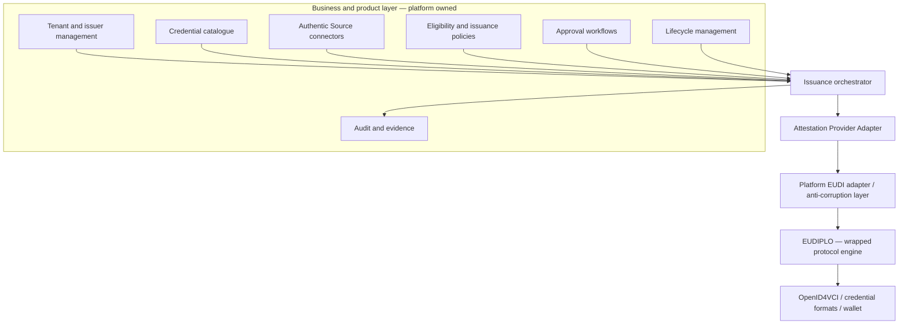
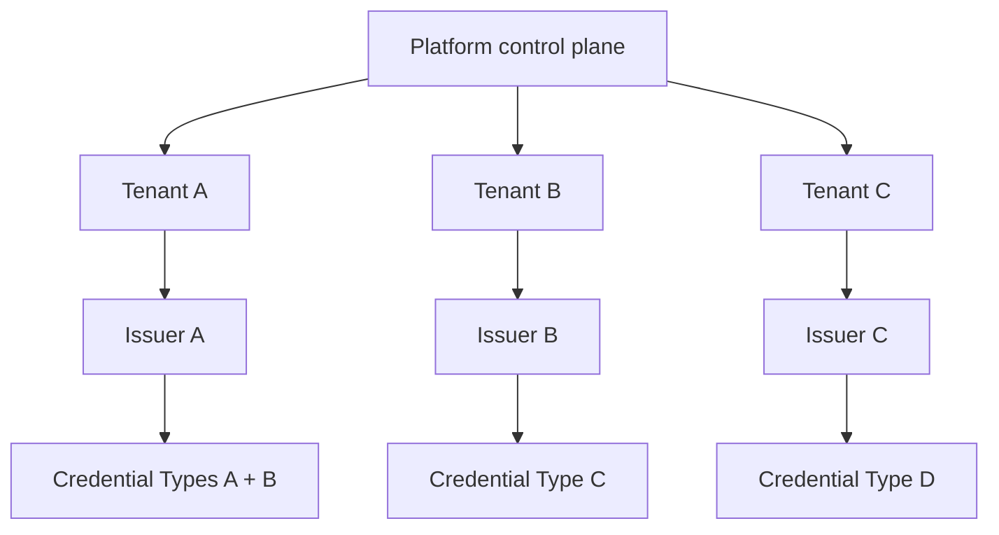

# Issuance Service Architecture

**Status:** [PRODUCT] / [EXPERIMENTAL]

## Layered boundary

EUDIPLO provides protocol capability. The platform owns business orchestration. Business rules, eligibility, Authentic Source semantics, approval workflows, commercial tenancy and product APIs must not move into EUDIPLO.

## Orchestration responsibilities

For each transaction, the orchestrator resolves and snapshots the Credential Type, policies, Delegation Profile, mappings and security configurations. It then creates work for the assigned actor, verifies hand-off evidence, applies timeouts/retries, and invokes the EUDI adapter only after approval conditions are satisfied.

The Attestation Provider Adapter resolves the regime-specific legal provider, technical operator, trust identity, K1-K4 signing route, approval/revocation authority and external evidence before protocol execution. The EUDI adapter then translates authorised canonical commands/results into EUDIPLO APIs and events. It owns compatibility mapping, error normalization and contract tests, allowing the protocol engine to be upgraded or replaced without exposing it to customers.

## Authentic Source connectivity

An Authentic Source Connector is a first-class shared component. Potential adapters include REST, SOAP/legacy services, justified read-only database access, event subscriptions, file/batch transfer and sector-specific APIs. `[PRODUCT]` This is a capability envelope, not an MVP commitment to every pattern.

Minimum controls:

- workload/service authentication, least privilege and purpose-bound authorization;
- source/field allow-lists and data minimisation before persistence or policy evaluation;
- secrets in a managed secret store, rotation and separation by tenant/environment;
- network isolation, egress restrictions, TLS and source authenticity/integrity checks;
- auditable requests and decisions without logging full sensitive payloads;
- explicit caching prohibition or bounded, encrypted caches with provenance and freshness;
- timeouts, circuit breaking, retry/idempotency and unavailable/stale-source policy;
- event ordering, deduplication and reconciliation for source-driven lifecycle actions.

Connector availability does not alter source authority. A cached or transformed observation remains evidence from the named source, not a new Authentic Source.

## Multi-tenancy

Isolation must cover issuer identity/metadata, signing keys, trust/status configuration, Credential Configurations, source connections/secrets, policies, transactions, audit and administrators. `[OPEN]` The exact control-plane/data-plane topology, database partitioning, key hierarchy and administrator model require threat modelling.

## Lifecycle triggers

| Trigger | Example | Control |
|---|---|---|
| Customer-driven | Customer requests revocation | Authenticated command, authorization and idempotency |
| Source-driven | Employment source reports termination | Provenance, freshness, policy evaluation and reconciliation |
| Platform-driven | Validity period reaches expiry/renewal window | Versioned schedule and deterministic policy |
| Hybrid | Source change creates a revocation approval task | Separation of duties, deadline and escalation |

See [Attestation Provider architecture](attestation-provider-architecture.md), [Issuance as a Service](../05-eudi-services/issuance-as-a-service.md), [product model](../05-eudi-services/issuer-product-model.md), [EUDIPLO assessment](../05-eudi-services/eudiplo-assessment.md), and [MVP](../09-product-roadmap/issuance-mvp.md).
