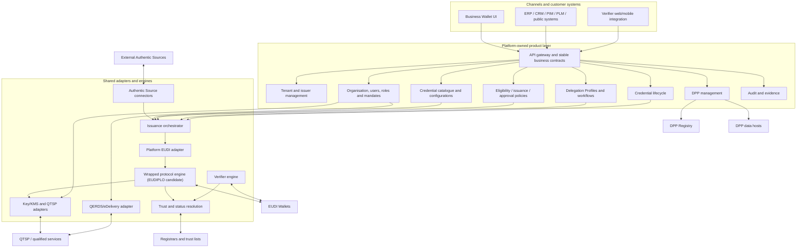

# Target Architecture

**Status:** [EXPERIMENTAL] product architecture, not a normative European architecture

## Boundaries

- [PRODUCT] Configurable Delegation Profiles assign retrieval, eligibility, rules, approval and lifecycle work to customer, platform or hybrid workflow.
- [PRODUCT] Authentic Sources remain external and authoritative even when the platform connects to them, transforms observations or makes decisions.
- [PRODUCT] Business APIs, policies, workflows and domain state remain platform-owned; EUDIPLO stays behind the platform EUDI adapter.
- [SPECIFICATION] Wallet-facing exchange follows applicable EUDI protocols, formats and trust rules.
- [REGULATORY] Qualified services remain inside the accountable QTSP boundary; an adapter does not confer qualified status.
- [REGULATORY] The DPP Registry is the registration/indexing layer, while complete DPP data is maintained outside it by the Economic Operator or its provider.
- [OPEN] Platform execution does not settle Attestation Provider identity; EAA, PuB-EAA and QEAA allocations require legal/regulatory analysis.
- [OPEN] Deployment zones, tenancy topology, data residency, assurance levels and authoritative trust sources require validation.

See the [component model](component-model.md), [issuance service architecture](issuance-service-architecture.md), [integration model](integration-model.md), and [reuse strategy](reuse-strategy.md).
