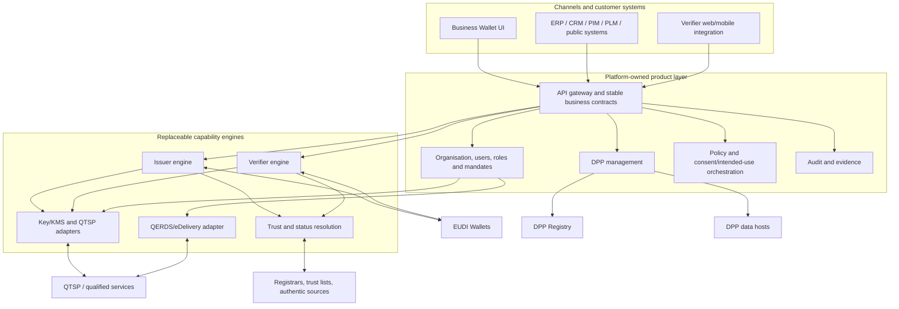

# Target Architecture

**Status:** [EXPERIMENTAL] product architecture, not a normative European architecture

## Boundaries

- [PRODUCT] Business APIs and domain state remain platform-owned; protocol engines are replaceable adapters.
- [SPECIFICATION] Wallet-facing exchange follows the applicable EUDI protocols, formats and trust rules.
- [REGULATORY] Qualified services remain inside the accountable QTSP boundary; an adapter does not confer qualified status.
- [REGULATORY] The DPP Registry is the registration/indexing layer, while complete DPP data is maintained outside it by the Economic Operator or its provider.
- [OPEN] Deployment zones, data residency, assurance levels and authoritative trust sources require validation per service and Member State.

See the [component model](component-model.md), [integration model](integration-model.md) and [reuse strategy](reuse-strategy.md).
