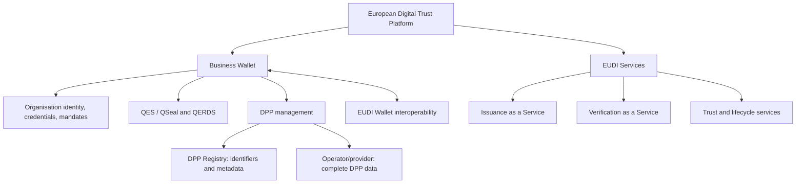

# European Digital Trust Platform

Evidence-driven knowledge, architecture and product-design repository for reusable services around the European Digital Identity ecosystem. The implementation baseline is the official EUDI Wallet Reference Implementation, the EUDI Architecture and Reference Framework (ARF), and—in a deliberately bounded role—EUDIPLO.

> This repository does not use Spain's Cartera Digital as its technical or product baseline.

## Vision

The platform explores reusable capabilities that allow organisations to participate in the emerging European digital identity and trust ecosystem without implementing its full regulatory, trust and protocol complexity themselves.

Two complementary product tracks are currently explored:

1. **Business Wallet** — a digital trust workspace for organisations to manage organisational identity, credentials, mandates and representation, QES/QSeal, legally valid communications/QERDS, DPPs and interactions with EUDI Wallets.
2. **EUDI Services** — Issuance-as-a-Service and Verification-as-a-Service capabilities aimed especially at public-sector bodies, SMEs and other organisations.

## Repository structure

- `01-vision` — platform vision and product hypotheses
- `02-eudi-wallet` — EUDI Wallet ecosystem and reusable foundations
- `03-business-wallet` — EUBW regulatory/product exploration
- `04-digital-product-passport` — DPP and Business Wallet integration
- `05-eudi-services` — issuance and verification services
- `06-shared-capabilities` — common platform building blocks
- `07-use-cases` — initial target use cases
- `08-architecture` — target architecture and integration model
- `09-product-roadmap` — capability map, reuse decisions, gaps and roadmap
- `references` — authoritative and working references

## Status convention

Every material claim should carry or inherit one of these markers:

- `[REGULATORY]` — grounded in adopted legislation.
- `[PROPOSED-REGULATORY]` — grounded in a proposal, not final law.
- `[SPECIFICATION]` — defined by the ARF, an implementing act or a technical standard/specification.
- `[PRODUCT]` — a platform choice or product hypothesis.
- `[EXPERIMENTAL]` — a PoC or implementation hypothesis under evaluation.
- `[OPEN]` — unresolved; requires validation.

Product language such as “should” is not a legal requirement unless a cited regulatory source says so. See the [evidence policy](references/README.md).

## Primary references

- [EUDI Wallet ARF 3.0](https://eudi.dev/3.0.0/) (released 21 July 2026)
- [Official EUDI Wallet Reference Implementation](https://github.com/eu-digital-identity-wallet/.github/blob/main/profile/reference-implementation.md)
- [EUDIPLO](https://github.com/openwallet-foundation/eudiplo)
- [European Business Wallet proposal](https://digital-strategy.ec.europa.eu/en/library/proposal-regulation-establishment-european-business-wallets)
- [Digital Product Passport](https://single-market-economy.ec.europa.eu/single-market/digital-product-passport_en)
- [European Commission eDelivery](https://ec.europa.eu/digital-building-blocks/sites/spaces/DIGITAL/pages/467110114/eDelivery)
- [Regulation (EU) 2024/1183](https://eur-lex.europa.eu/eli/reg/2024/1183/oj/eng), amending Regulation (EU) 910/2014

## Current phase

The first phase establishes the evidence baseline, reuse decisions and testable architecture hypotheses. Start with the [platform vision](01-vision/platform-vision.md), [target architecture](08-architecture/target-architecture.md), [reuse strategy](08-architecture/reuse-strategy.md), [capability map](09-product-roadmap/capability-map.md), and [open gaps](09-product-roadmap/gaps.md).

For the issuance product, see [Issuance as a Service](05-eudi-services/issuance-as-a-service.md), the [issuer product model](05-eudi-services/issuer-product-model.md), [issuer onboarding](05-eudi-services/issuer-onboarding.md), [issuance service architecture](08-architecture/issuance-service-architecture.md), and [incremental MVP](09-product-roadmap/issuance-mvp.md).
