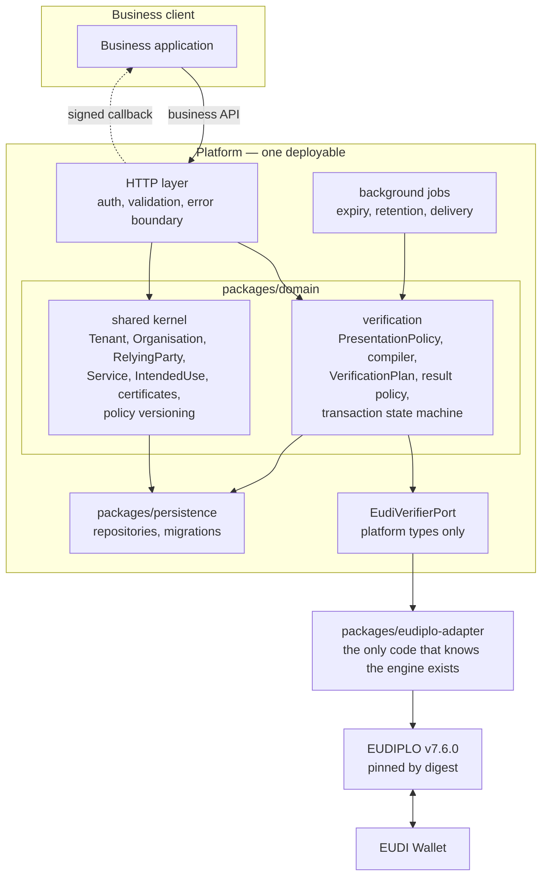

# Architecture

Milestone 1: platform foundations and Verification as a Service.

---

## 1. Shape

A modular monolith. One deployable, bounded contexts as modules, the protocol engine wrapped
behind platform-owned ports.



Dependencies point inward. `domain` depends only on `shared`; the ports and persistence depend on
`domain`; the adapter depends on the ports; `apps/platform-api` is the only composition root.

## 2. The engine boundary

`EudiVerifierPort` carries platform types only: a `VerificationPlan` in, a normalised outcome out.
Produced **inside** the adapter and never above it: DCQL, the `x509_hash` client-id scheme,
`direct_post.jwt`, `walletNonce`, the engine's presentation configuration, and the engine session
reference.

This is enforced by `scripts/check-boundaries.mjs`, which fails the build if the engine's name or
its protocol vocabulary appears outside `packages/eudiplo-adapter`. One exception is listed
explicitly: `composition.ts`, because somebody has to choose which implementation satisfies the
port.

The contract the platform actually depends on is small enough to re-implement against another
engine: `{uri, crossDeviceUri, session}` from the offer, the `SessionOutcome` failure taxonomy,
`GET /session/:id`, `DELETE /session/:id` and `PUT /session-config`.

**The adapter is stateless.** Every call that addresses an existing session takes an
`EngineSessionHandle` carrying both the session and its engine tenant, because the engine scopes
each call to the tenant of the presenting token. The platform stores both on the transaction, so
nothing is held in process memory and a restart loses nothing.

## 3. The engine tenant mapping

**One engine tenant per `RelyingPartyInstance`** — per Relying Party Service and trust
environment — not one per platform `Tenant`. ADR 0002 Decision 3.

The naming invites the wrong mapping. What settles it is that the engine scopes key material,
certificates and registrar configuration to *its* tenant, while ARF scopes those to a Relying
Party **Service**: an access certificate carries one RP identifier and one Service identifier
(`Reg_32`, `Reg_33`), a registration certificate must carry the Service identifier of its
Instance's access certificate (`RPRC_10`), and the engine derives `rpId` from its tenant's
registrar relying party with no per-request override.

A consequence worth stating: a platform `Tenant` with two Organisations of two Services each
needs four engine tenants, and the `ENGINE_TENANT_CREDENTIALS` configuration grows with Services
rather than with customers.

## 4. Request flow

```mermaid
sequenceDiagram
  participant App as Business application
  participant API as Platform API
  participant Dom as Domain
  participant Port as EudiVerifierPort
  participant Eng as Engine
  participant W as Wallet

  App->>API: POST /v1/presentations {policyId, businessReference}
  API->>Dom: resolve latest published version
  Dom->>Dom: load registration context
  Dom->>Dom: compile → VerificationPlan (re-validated)
  API->>API: resolve callbackUrl against the Service allow-list
  API->>API: persist transaction (CREATED)
  API->>Port: createPresentationRequest(plan, SAME_DEVICE, ttl)
  Port->>Eng: PUT /session-config (ttl, anonymize)
  Port->>Eng: POST /verifier/config (DCQL built here)
  Port->>Eng: POST /verifier/offer
  Eng-->>Port: {uri, crossDeviceUri, session}
  Port-->>API: handle + opaque interaction URI
  API->>API: CREATED → REQUEST_READY → AWAITING_WALLET
  API-->>App: {presentationId, interaction, expiresAt}

  App->>W: open the interaction URI
  W->>Eng: OpenID4VP request object, then the response
  App->>API: GET /v1/presentations/{id}
  API->>Port: getPresentationStatus(handle)
  Port->>Eng: GET /session/{id}
  Eng-->>Port: status + failureCode + structured outcome
  Port-->>API: SETTLED + platform outcome
  API->>Port: processPresentationResult(handle)
  Port-->>API: disclosed claims (content)
  API->>Dom: applyResultPolicy — content discarded here
  API->>API: → PRESENTATION_RECEIVED → VERIFYING → VERIFIED
  API->>API: persist normalised result; enqueue signed callback
  API-->>App: {status, result.claims}
```

The content — `disclosedClaims` — exists only between `processPresentationResult` and
`applyResultPolicy`, inside one method. It is never assigned to a field, queued, or logged.

## 5. Outcome normalisation

The engine's session status is `active | fetched | completed | expired | failed`. **`failed` is
not decidable** — it covers trust, signature and protocol failures alike — so the adapter branches
on the machine-readable failure code the engine added in v7.5.0, never on the status.

| Engine signal | Platform outcome |
|---|---|
| `completed`, outcome success, policy satisfied | `VERIFIED` |
| `completed`, outcome success, policy not satisfied | `POLICY_NOT_SATISFIED` |
| `signature_invalid`, `certificate_expired`, `x5c_missing` | `REJECTED` |
| `no_trust_chain_to_root`, `trust_chain_not_trusted` | `TRUST_ERROR` |
| `trust_list_unavailable` | `TRUST_ERROR`, flagged **verifier-side** — our failure, not a bad credential |
| OpenID4VP `access_denied` | `DECLINED_BY_USER` (best-effort; see `RPA_11`) |
| anything unrecognised | `PROTOCOL_ERROR`, raw code retained |
| `expired` | `EXPIRED` |
| platform-initiated delete | `CANCELLED` |

An unrecognised code degrades safely and visibly rather than being misclassified as something
more specific — which matters given the engine's release cadence.

## 6. State machine

`CREATED → REQUEST_READY → AWAITING_WALLET → PRESENTATION_RECEIVED → VERIFYING → terminal`.

Two deliberate asymmetries:

- **`CANCELLED` is reachable only while still waiting on the wallet.** Once a presentation has
  been received the User has already disclosed attributes, and cancelling then would leave no
  recorded outcome for a disclosure that happened.
- **`EXPIRED` is reachable from every non-terminal state**, because the transaction lifetime is
  the platform's promise to the customer and must hold even if the engine stops responding.

The engine reports a coarse status, so the platform walks the intermediate states explicitly
rather than jumping to a terminal one. The transition log therefore records what was observed.

Every transition is validated against the table **and** applied with the expected prior state in
the `WHERE` clause, so two concurrent pollers cannot both settle the same transaction.

Delivery status is tracked separately (`NOT_REQUIRED | PENDING | DELIVERED | FAILED`), so a
delivery failure never changes the verification outcome.

## 7. Data classes in storage

| Class | Tables |
|---|---|
| Configuration | `tenants`, `api_keys`, `organisations`, `relying_parties`, `relying_party_services`, `intended_uses`, `registration_certificates`, `access_certificates`, `relying_party_instances`, `presentation_policies`, `presentation_policy_versions` |
| Transaction metadata | `presentation_transactions`, `presentation_transaction_transitions` |
| **Content** | **none** |
| Derived result | `presentation_results` |
| Audit evidence | `audit_events` |
| Delivery | `webhook_deliveries` |

Separate tables, separate lifetimes. That is what lets the retention job delete results while the
metadata and audit trail survive — evidence that a verification happened outliving the values.
`tests/integration/migrations.test.ts` asserts the exact table list, so adding a content table
would fail the build.

## 8. Migrations

Checked-in SQL, generated from the schema and reviewed, applied by a checksum-verifying migrator.
Editing an applied migration is a hard failure: it is how two databases silently diverge. A
session-level advisory lock serialises concurrent runs, so two replicas starting together cannot
race on `CREATE TABLE IF NOT EXISTS` — which is not concurrency-safe in PostgreSQL.

There is no schema auto-synchronisation anywhere, and no code path that creates a table outside a
migration. The migration ledger is owned by the migrator and deliberately **not** declared in the
Drizzle schema, or migration 0000 would try to create a table the migrator had already made.

## 9. Tests

| Suite | Runs | Covers |
|---|---|---|
| `unit` (146) | always | claim-path subset semantics, policy validation, the compiler, result policies, the state machines, outcome normalisation, DCQL, webhook signing, log redaction |
| `integration` (69) | always — boots an embedded PostgreSQL, no Docker needed | migrations from empty, the whole business layer against a fake port, tenant isolation, policy versioning, delivery, retention, jobs |
| `adapter-contract` (6) | **skipped** when no engine container is reachable | authentication, retention application, error shapes against a real engine |

The integration suite uses a real PostgreSQL because the properties under test are ones only a
real database has: the checked-in migrations, unique indexes and foreign keys, `jsonb`
round-trips, the conditional-update concurrency guards, and `FOR UPDATE SKIP LOCKED`. Each test
file gets its own database, so files cannot truncate each other's data.

The business layer is tested by building the **real** dependency graph and substituting only the
port, so what the tests exercise is what runs.

## 10. Deliberately not built

No services, no broker, no CQRS, no event sourcing, no rules engine, no expression language, no
multi-region. `DERIVED_CLAIMS` transformations and the `EligibilityEvaluator` are named
TypeScript implementations registered at startup, which is what the V0 plan asks for and what the
existing knowledge base records as the open question it is.
